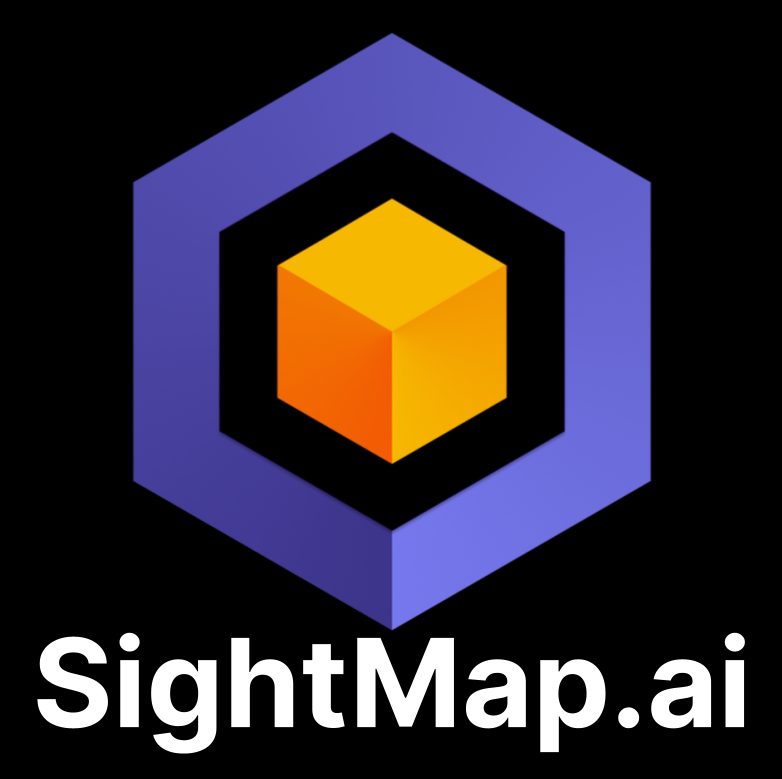
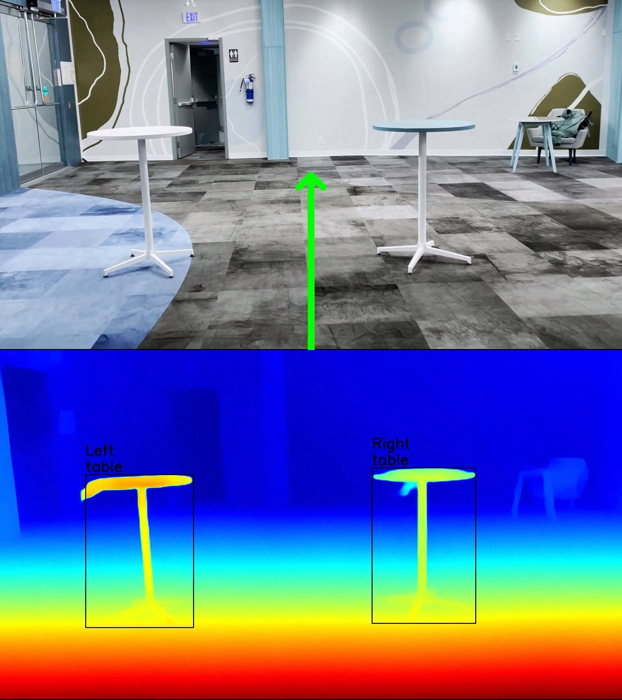

# SightMap


A comprehensive AI assistant tool to aid visually impaired individuals in understanding and navigating their surroundings.

## Table of Contents
- [Dependencies](#dependencies)
- [Usage](#usage)
- [Demo](#demo)
- [Citation](#citation)

## Dependencies

To install the required Python packages, you can use pip. Below are the packages needed to run this project:

- OpenCV (`cv2`)
- PyTorch (`torch`)
- Matplotlib (`matplotlib`)
- NumPy (`numpy`)
- Pillow (`PIL`)
- Regular Expressions (`re`) - Note: This is part of Python's standard library, so it does not need to be installed separately.
- Ultralytics YOLO (`ultralytics`)

## Usage
**1. Clone the repository:**

```git clone https://github.com/Zahrabrhm/SightMap.ai.git```

**2. Navigate to the project directory:**

```cd SightMap.ai```

**3. Update Video File Path:**

In the `main.py` file, locate the line where the video file path is defined. Replace the existing path with the path to your video file. Ensure the path is either absolute or relative to the project directory.

**4. Run the main script with the following command:**

```python main.py```

## Demo

To Watch a video demonstration of our system in action click [here](https://www.youtube.com/watch?v=N68TiqHG25s).



## Citation 

If you use this code in your research, please cite this repository as follows:
```bibtex
@misc{Zahrabrhm2024SightMap,
  author = {Zahra Ebrahimi Jouibari, Sevy Veeken, Mira Patel, Destiny Bailey},
  title = {SightMap},
  year = {2024},
  publisher = {GitHub},
  journal = {GitHub Repository},
  howpublished = {\url{https://github.com/Zahrabrhm/SightMap.ai}}
}
```


